- one third, two thirds(两个三分之一就变成复数形式了),

- 13.87 小数点前面读两位数，小数点后面读个位数。所以读作 thirteen point eight seven。

- 113.423 读作 one hundred and thirteen point four two three

- quarter是四分之一的意思， 比如 a quarter to eight 这里quarter就是15分钟， a quarter of the class， 这里就是班级1/4的学生数。
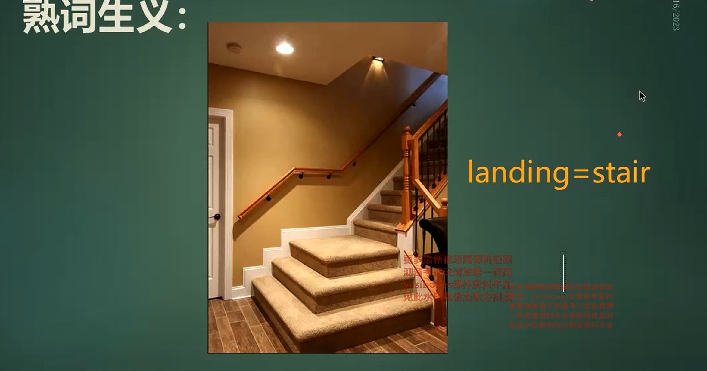

 
审题技巧1:
！
- 要求只写一个单词， 如果答案是数字， 比如 30， 应该写作 thirty
- 快速浏览答题的位置前面的一个词语，比如 with，proving 等大概知道答案应该是什么词性
- 特殊人名地名可以留意一下
- 每一道题目最前面的单词如果没有什么特殊性，就可以忽略，比如这里的好多都是help开头，那就没有特殊性。没有什么帮助
- 每一道题目都一个特殊符号，比如这里的点，代表每一道题目之间都是并列关系
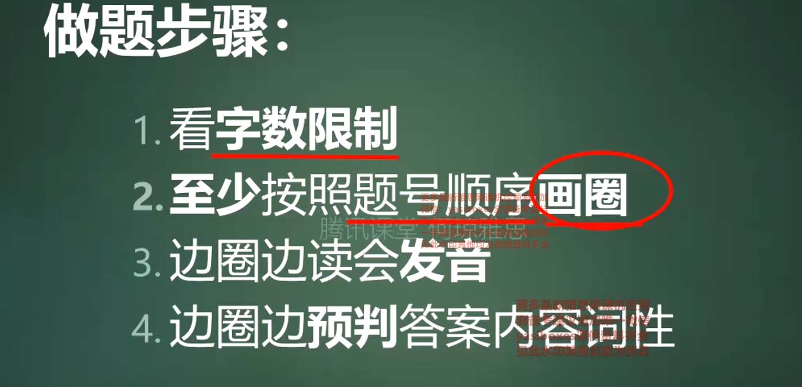
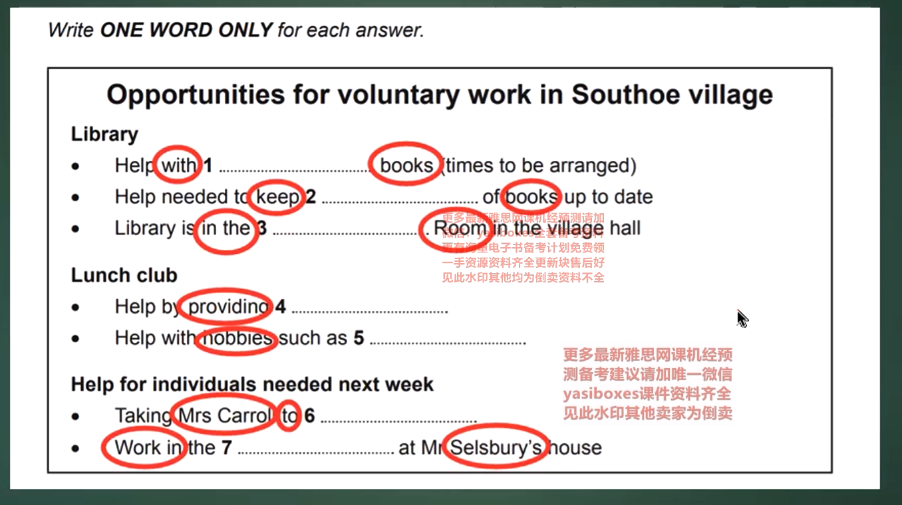
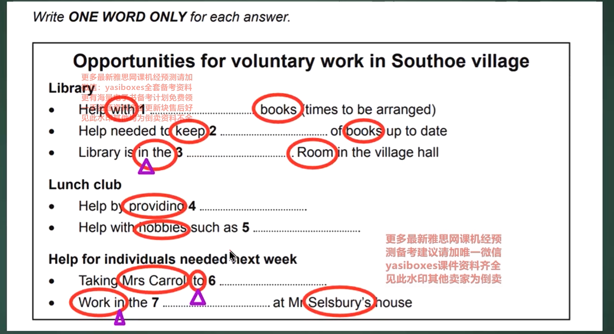
- 介词也不会随便修改，可以帮助我们判断答案

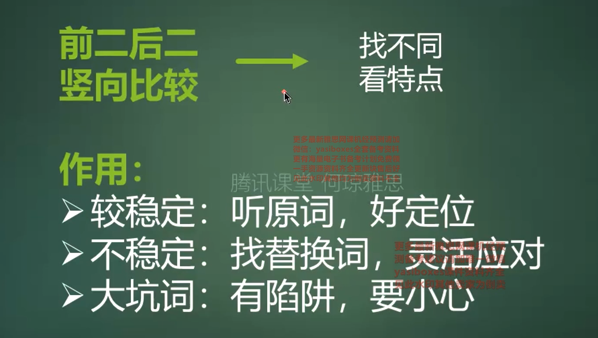
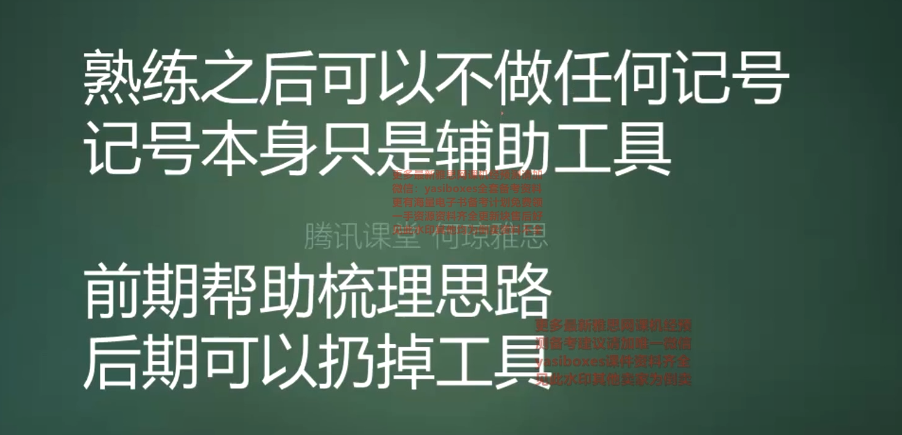
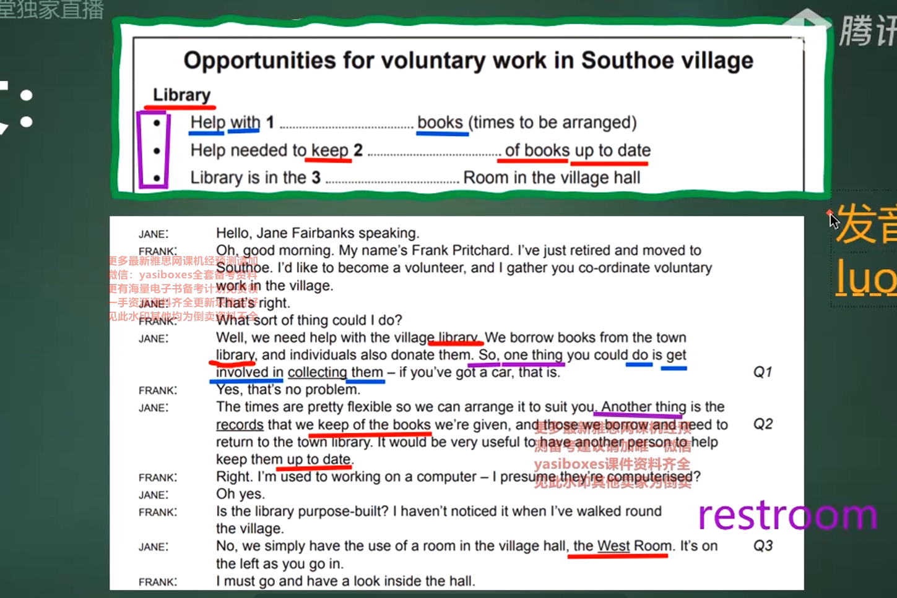
- 答案和原文也有类似阅读里面的单词改写
- 还有一些关键词 比如 so, one thing, another thing， but... 这些关键的词语后面的词语很重要
- 发音，逻辑，改写 三点主要的是发音。发音准确了就更容易做出来
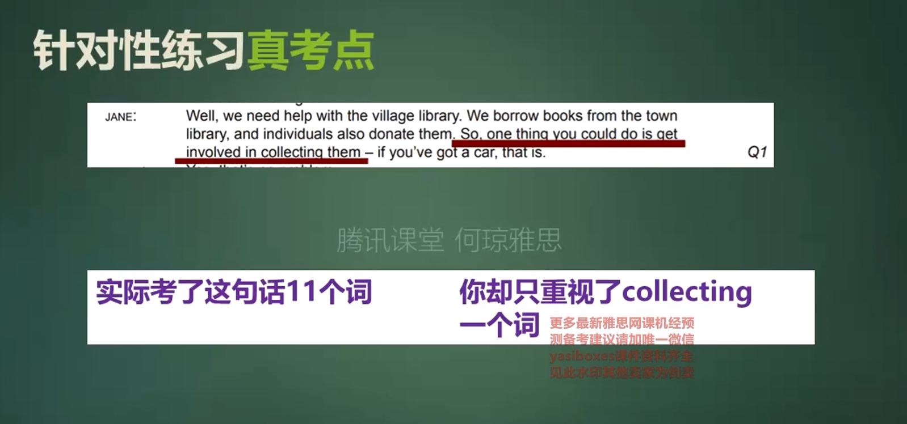
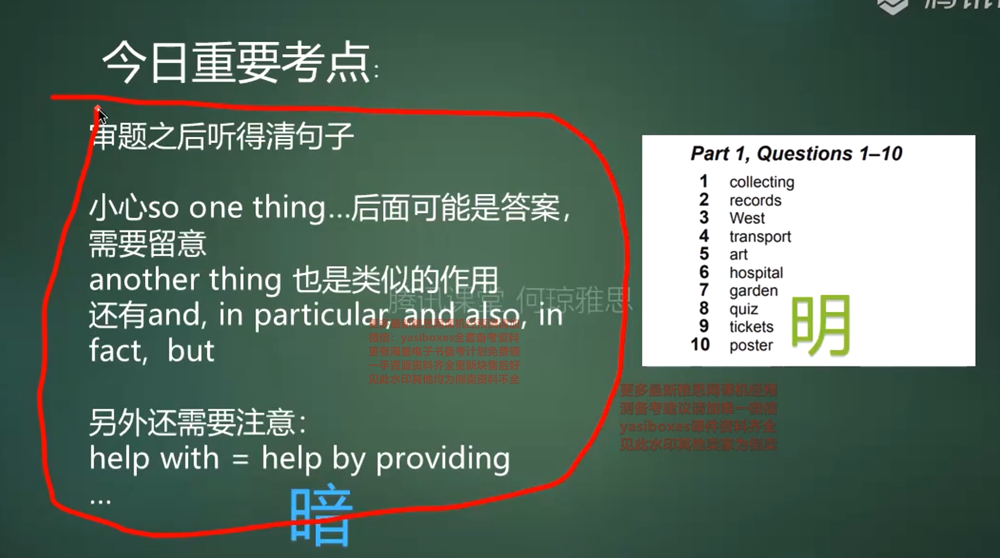
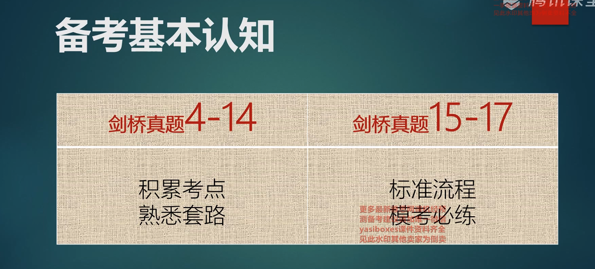

电话号码自己要可以快速流畅度出来，听到一半就知道再说什么。
网购平台单号都可以自己去读。

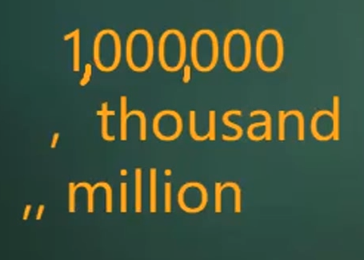
- 记住这个技巧，听到million就是两个逗号， thousand 就是一个逗号。billion就是3个逗号。
- 比如4，627，862，646就读作 four billion six hundred and twenty seven million eight hundred and sixty two thousand six hundred and forty six。
- 100,000 读作 one hundred thousand

- 7-screen cinema 翻译为7块屏幕的电影院，-连接后面的screen不用变为复数形式，因为前面的7在这里类似于形容词了。
- 4-liter engine 4升的发动机

人生没有失败，要么成功了，要么收获了教训。

- 前门 front door/gate， 后门 back door/entrance/gate, 旁边的门 side door/entrance/gate
- corner bend 转弯, sharp corner 急弯 
- path 路线，arrow 箭头， bottom 下面，right,left, top, bottom left, bottom right, top left, top right

- 地图题里面 drive也可以指代 road， practice可以表示诊所，律所, film可以表示薄膜，比如卖水果的 切好的水果上面覆盖的保鲜膜（film gloves 一次性手套），foil 锡纸， plant 类似于工厂的意思=factory， plan 有地图的意思

机考时候会发给你草稿纸，草稿纸上面对照屏幕一起看你标注的方位

- 河上面有可能会画桥，需要注意 bridge, 
- 标注了东南西北的也有可能说上下左右， 只标注了上下左右的就是基本上说上下左右了
- past bhe bridge 路过桥而已。 表达经过桥 pass the bridge 语法是错误的，正确的应该是 over the bridge
- right 地图题目有可能说的是，刚好，正好。比如 that's right at the other side of the castle from the entrance

- 题目是小写，并且加了形容词，那么很有可能就会听到改写词。这个时候做题就需要靠题目的逻辑顺序来做了。

