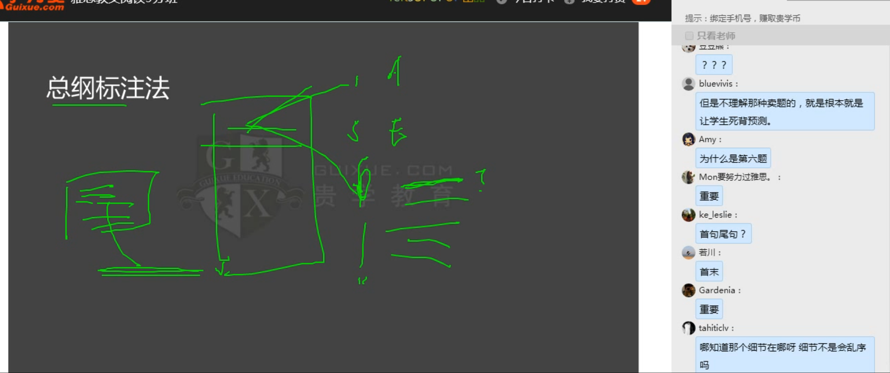

- 匹配乱序多，单词找同义
- 488经典词汇要记住
- 刘洪波讲的词汇课有趣，以后可以学学

## 要想定位快的技巧方法
### 1. 读题要慢，至少读2遍
- 读得懂的题目，或者文章内容，需要慢慢读
- 读不懂的文章，需要快点读
- 国外阅读研究，太快了反而可能适得其反，大脑会胡思乱想。需要快慢结合，flexible。这样就可以按照自己的喜好，有节奏的高质量的阅读。
### 2.定位关键词
#### 2.1 眼球级词汇
- 数字大写，字母大写
#### 2.2 朴素级keyword
- 常用的单词，单词替换也可以认的出来
#### 2.3 逻辑关系词
#### 2.4 并列，转折，因果关系的词语
- 这些词语如果题干里面出现，原文里面肯定要有对应的地方匹配，不然就是篡改原文了

## 段落匹配题技巧
- 通过题干找到原文的出处，然后再看对应的选项是不是那段原文答案的对应的改写
- 可能选项有a到j好多个，但是做第一个题的时候，虽然花点时间。不过越到后面你越熟悉那些答案选项了，更加容易了
- 朴素级keywords和并列逻辑关系词的捆绑结合举例：
    - 问题的题干是： xxx of footbridges, steps and handrails
    - 你应该看的关键词就是 foot and hand, 这就是最朴素的词，不用管什么footbridges and handrails
    - 还有这道题可以看出来，题干的并列结构帮助你定位。原文中的对应上下文内容也有并列结构。帮助你确定答案
- 每一道题目都要按照这些思路，找到同义替换，哪里错了。哪个同义替换没搞懂，都给我记住。不管花多少时间都要这样做，不要靠感觉
- 一道题目拿不准的时候，多找一点同义替换，去帮助你定位这道题目的答案
- 做题的时候要卡时间，复盘的时候不需要卡时间。--》 这是错误的，因为你还没有把重要的知识点弄扎实。应该到后面才卡时间
- 先学习方法然后做题目，不然就是浪费题目，最多可以做一套题目 找找感觉，带着问题学习，不要盲目刷题
## 做题技巧
- 反对精读，提倡快速阅读和对比阅读
- 交叉做题，每个自然段先做细节题（比如判断题这种），然后做和他对应的heading题（也就是找文章段落对应的标题），一段话读完，把和他相关的题目一起做了，比如第一题是让你选择段落匹配题，第六题是判断题，而且都是和第一段有关的内容，那么通过做判断题掌握了细节，再去做heading题这样就是一箭双雕，这个好处就是可以快速把题目做完。充分利用当前最熟悉的内容，也就是你的大脑的上下文。因为雅思考官也希望围绕一段话中心思想来出题的，只不过出了两种题而已，分散到了不同题型里面
- 一般没必要的词语可以直接划掉，比如description，好多题目答案都有这个类似的描述，根本就是浪费时间，可以不用看

- 口语可以慢下来，你是高手，比平常练习的时候慢才显示你是在当场交流，而不是背答案。
## 题型： which paragraph contains the following information
- 这种题型非常难
- 每个选项的keywords画出来 
- 有这种题目的时候，可以跳过看summary题目，或者判断题之类的
- 操作思路也是类似，先把summary题型（比如填空题 one word only之类的）看一个段落，然后再看刚才（paragrash contanins这个题型）里面对应的选项。还有就是NB（比如paragrash contanins这个题型）大部分时候会有一个选项可以对应两道题，那么你是在需要猜答案的时候，就选段落长的那个段落，毕竟内容多。出两个题目概率大
- summary题型主要核心思想就是 那个填空位置前后的名词动词，你能不能找到同义替换，这一点和听力几乎是一样的
## 题型： 题空，no more than two words
- 一样的思路，这种题可以先做。为heading，段落匹配题之类的大义概括题目做准备
## 题型： true,false,not given
- 一种是简单的方式，直接可以看出来，比如before，after之类的
- 两一种就是关系型的驳斥，比如原文说到a是因为b导致的。但是问题说的是a是因为c导致的，那么肯定就是false，不要以为是not given， 这是因为这种关系他已经给你解释清楚了，不存在哪里不清楚的地方
- 老外写的句子之间，上下句有逻辑关系的。有的时候你发现题目和原文之间出现了因果倒置的矛盾关系，那么就肯定是错误的false
- 从命题者思路分析，true或者false题目，他可能给你出题就是一句话的单词改一改或者同义替换（这里同义替换可能有三种维度需要注意），或者因果倒置
- false的时候，大部分就是把某一个词语替换为反义词
- true的时候，为了迷惑你，会尽可能把大部分单词进行同义替换改写，所以一个题目如果你发现很多同义改写，尽管其他的单词你不认识。这个时候大概率是
true
- not given:
    - a或者b找不到
    - a或者b都有，但是关系没有提到，也就是类似于某个词没有看到他的改写或者他的反义词，比如more than这种题干说到了，但是文章里面没有说到这种关系
    - 一般6个题目 2true，2个false，2个not given，首题not given比较少见。而且2个not given是不一样的出题思路。一般关系型的ng先出来，再出a或者b找不到那种
    - 一篇文章出题顺序有可能就是 t，f，ng，t，f,ng类似这种题型
## 题型：多选题
- 一般多选题答案都是并列句子提供的，优先看
## 题型： 单选题技巧
- 错误选项特征1: 答案基于原文改了一个动词或者新加了一个动词，或者形容词之类的
- 错误选项特征2: 选项的内容和题干的内容间隔有点远，基本上是错的
## 题型： Matching
- 本质上都是连连看，是单词的匹配
## 题型： heading
- 基本上只要是这篇文章出了细节题（比如true，false，not given那样需要看细节的题），那么很大概率你就可以在做细节题过程中把这段文章大概意思搞清楚。紧接着做对应的heading题就很容易了

## 注意点
- 雅思文章有可能上一段提到了说有3个观点，但是那一段只说了其中一个观点。第二个观点第三个观点，很可能放到第二段去了。要注意heading题目的陷阱
- 做题技巧，比如雅思9，21页 出现了heading题目，然后紧接着是文章，再然后文章后面是紧接着两种细节题（选词，TFNG）。然后我们观察heading题目第一个题只是从文章B段开始，说明A段是留给了后面的细节题，那么后面的细节题第一个题肯定是A段里面找答案。不过细节题第一个题做完之后要注意考官心思，可能细节题第二题他会分配到第二种题型去。因此第二种类型的细节题也要读一下题目。比如这个例子提到的，做完18题看19和21题，因为你不知道他下一句话会拿来出第19题还是第21题。
    - 原因解释：比如A段，他可以前三句话分别出题的顺序是 第一句-》 summary 细节题的第一题， 第二句-〉》 TFNG题的第一题， 第三句 -〉 summary细节题的第二题。 就是这样的交叉
- 一段话的首句，尾句不一定就是他对应的中心思想。因为有可能下一段话的首句是上一段话的中心思想总结。因为老外写作喜欢承上启下，因此就有这种可能。所以这句口诀要注意领会（段中找两点，中心藏后边）
